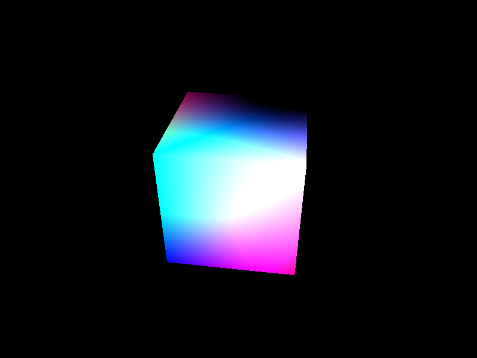
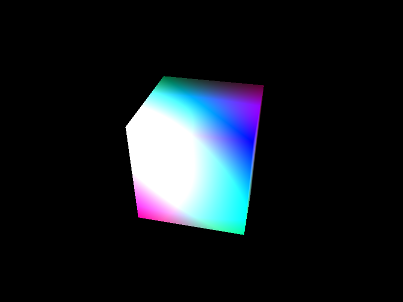
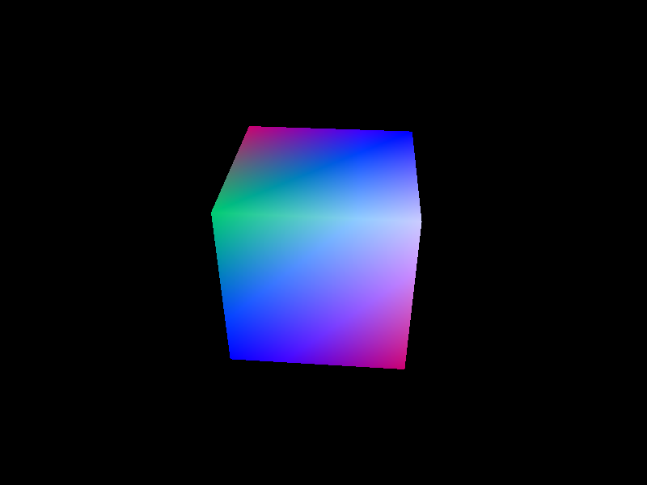
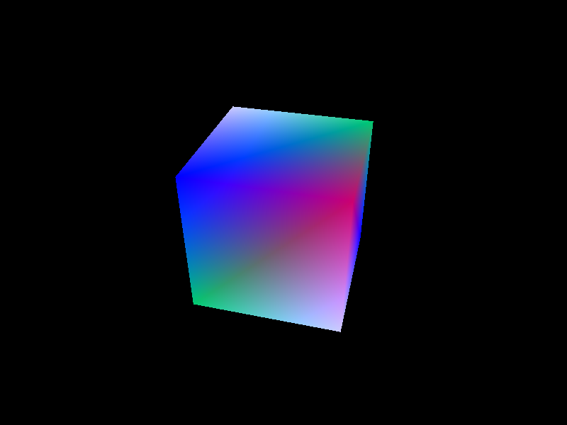

# shadedCubeApp

shadedCubeApp is a sample Vulkan app that I made to try out the Vulkan API. Currently, it supports two fragment shaders: a Diffuse Shader and a Bright Shader that takes lighting into account. The resulting rendered images can be seen below.

## Dependencies

shadedCubeApp depends on the [GLFW](https://www.glfw.org) and [GLM](https://github.com/g-truc/glm) libraries.

There is a `setup.sh` file that installs the required dependencies on Ubuntu systems. However, it has only been tested on Ubuntu 18.04 LTS. For any other system, please get pre-built binaries(or compile them) from their original sources.

## Building

In the working directory, simply use `make` to build the app and `make test` in order to run it. `make test` also takes an optional parameter `shader` which specifies which shader will be used. It defaults to the Diffuse Shader, but can be set to the Bright Shader by passing `shader=brightShader`

```
make
make test
make test shader=diffuseShader
make test shader=brightShader
```

## Rendered Images





